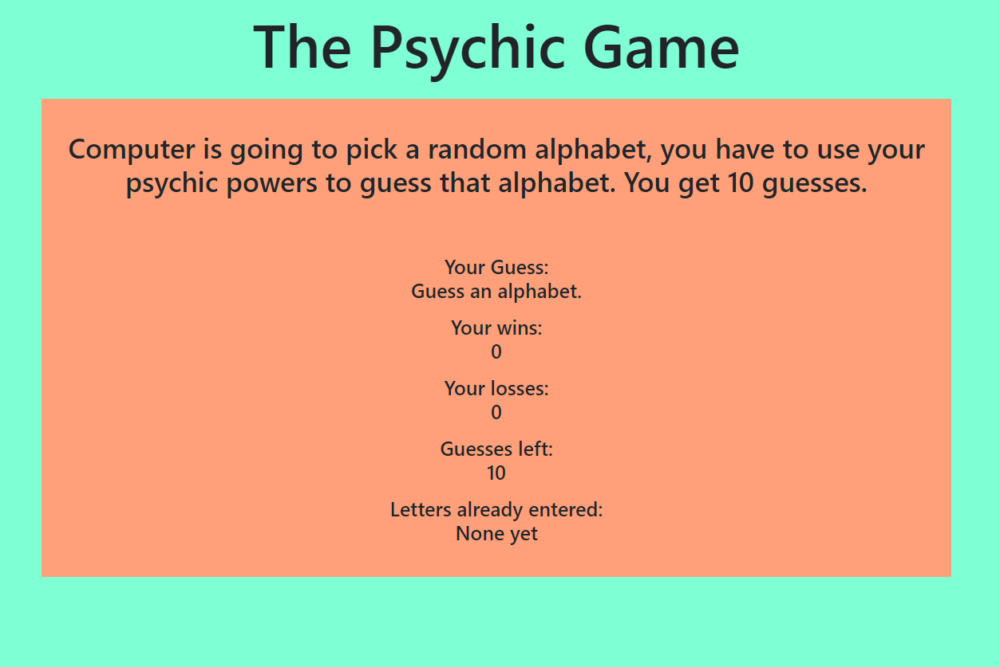
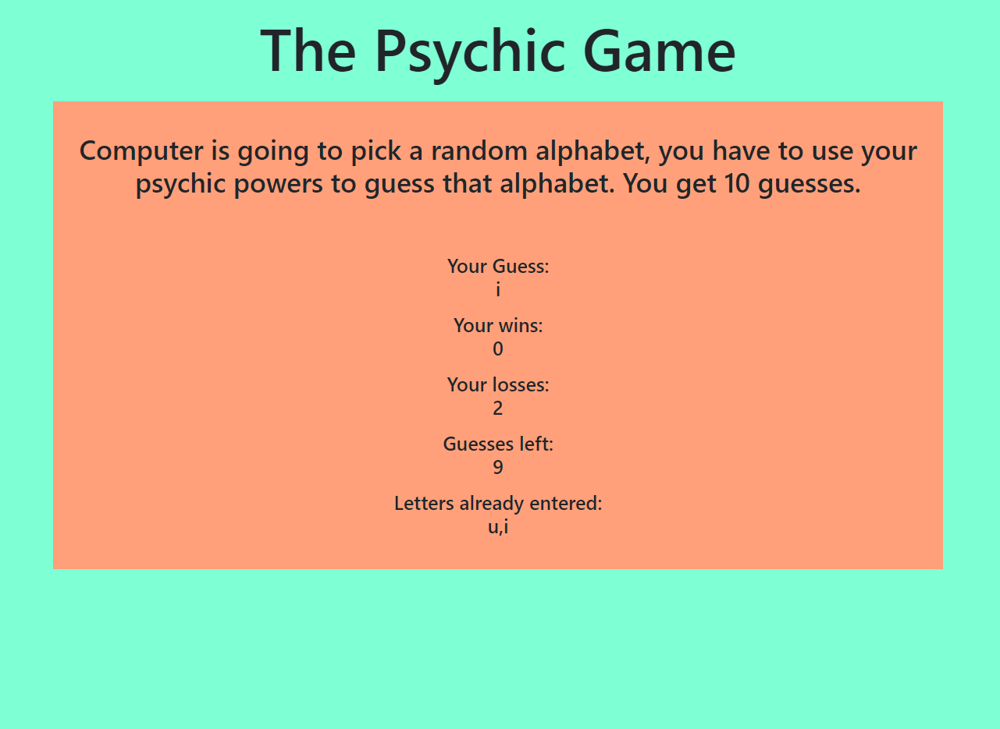

# Psychic-Game

### Overview

This is a basic alphabet guessing game. The computer randomly chooses a random alphabet and you get 10 chances to guess what that alphabet might be.

### Languages

* HTML
* Javascript
* CSS

### Explaination

* Once the page has loaded, you can hit any alphabet to start the game.
* The row 'Your Guess' will show you the last alphabet key you pressed.
* If you are able to guess the alphabet before the 'guesses left' are more than zero, your wins go up by one.
* If you are not ablet to guess the alphabet before the 'guesses left' get to zero, you losses go up by one.
* Every time you press a letter key, the 'guesses left' row will decrease the number of guesses left by one. Once it gets to zero it is reset to 10.
* The last row, 'letters already entered' will show you all the letters you have already entered that did not match the computer guess.
Once the wins or losses go up by win, this row is reset.

### Author

Manav Patel
